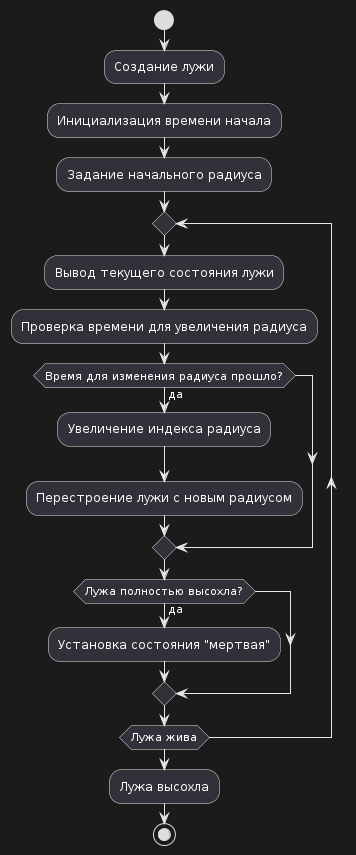
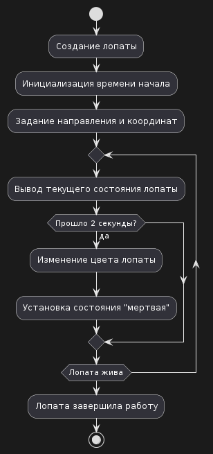
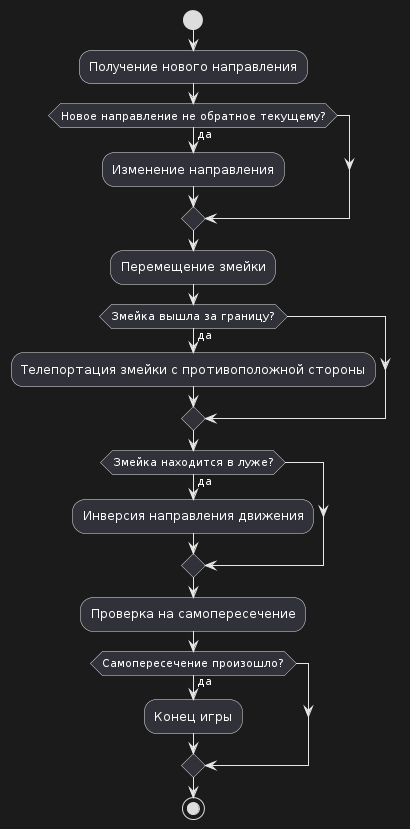
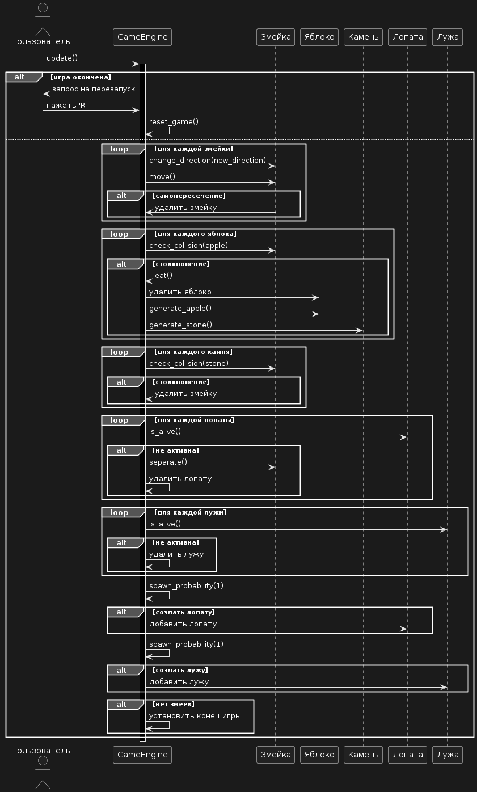

# Поведенческие модели

## Диаграмма состояния алгоритма создания и высыхания лужи

Эта диаграмма иллюстрирует процесс создания и высыхания лужи в игровом движке. Сначала происходит создание лужи, инициализация времени начала и задание начального радиуса. Затем происходит циклическое выполнение, где выводится текущее состояние лужи, проверяется время для увеличения радиуса, и, если оно прошло, происходит увеличение индекса радиуса и перестроение лужи с новым радиусом. Также проверяется, полностью ли лужа высохла, и если да, то устанавливается состояние "мертвая".

## Диаграмма состояния алгоритма работы лопаты

Эта диаграмма показывает процесс работы лопаты в игровом движке. Сначала происходит создание лопаты, инициализация времени начала и задание направления и координат. Затем происходит циклическое выполнение, где выводится текущее состояние лопаты. Если прошло 2 секунды, изменяется цвет лопаты и устанавливается состояние "мертвая".

## Диаграмма состояния алгоритма передвижения змейки

Эта диаграмма иллюстрирует процесс передвижения змейки в игровом движке. Сначала получается новое направление движения. Затем проверяется, не является ли новое направление обратным текущему. Если нет, происходит изменение направления. Затем змейка перемещается. Если змейка вышла за границу, происходит ее телепортация на противоположную сторону. Если змейка находится в луже, происходит инверсия направления движения. После этого проверяется наличие самопересечения змейки. Если оно произошло, игра завершается.

## Диаграмма последовательности обновления игрового движка 

Эта диаграмма показывает последовательность шагов обновления игрового движка при выполнении метода update(). Пользователь взаимодействует с игровым движком, который обрабатывает движение змеек, столкновения с объектами (яблоками, камнями), управление лопатами и лужами, а также проверяет условия завершения игры.