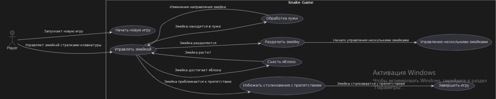

# Функциональные модели

# Управление змейками

## Сценарий использования

- **Пользователь**: Нажимает клавиши W, A, S, D для управления каждой змейкой.
- **Приложение**: Изменяет направление движения змейки в соответствии с нажатыми клавишами. Если змейка находится в луже, ее направление меняется на противоположное.
- **Пользователь**: Продолжает управлять змейками, используя клавиши для изменения направления.
- **Приложение**: Продолжает реагировать на действия пользователя, обновляя положение змеек на экране.

# Движение змейки

## Сценарий использования

- **Пользователь**: Наблюдает за игрой, не вмешиваясь в процесс.
- **Приложение**: При каждом вызове метода move(), змейка добавляет новую голову в направлении движения и удаляет последний элемент (хвост). Координаты ограничены размерами игрового поля.
- **Пользователь**: Продолжает наблюдать за движением змеек.
- **Приложение**: Продолжает автоматически перемещать змеек, соблюдая правила игрового поля.

# Поедание яблок

## Сценарий использования

- **Пользователь**: Наблюдает за игрой.
- **Приложение**: При каждом вызове метода update(), проверяется столкновение головы змейки с яблоком. Если столкновение произошло, яблоко удаляется из списка, змейка увеличивается в размере, и генерируется новое яблоко и камень.
- **Пользователь**: Наблюдает за результатами поедания яблок змейкой.
- **Приложение**: Продолжает отслеживать и обрабатывать столкновения змеек с яблоками.

# Растекание лужи

## Сценарий использования

- **Пользователь**: Наблюдает за игрой.
- **Приложение**: При каждом вызове метода draw(), проверяется, достиг ли радиус лужи следующего значения из списка puddle_radius. Если достиг, радиус меняется, и лужа перерисовывается с новым радиусом. Если радиус становится нулевым, лужа считается исчезнувшей.
- **Пользователь**: Наблюдает за изменением лужи и ее влиянием на игру.
- **Приложение**: Продолжает обновлять состояние лужи в соответствии с заданными параметрами.

# Управление несколькими змейками

## Сценарий использования

- **Пользователь**: Нажимает клавиши W, A, S, D для каждой змейки по отдельности.
- **Приложение**: Отображает изменение направления движения каждой змейки в зависимости от нажатых клавиш.
- **Пользователь**: Продолжает управлять змейками, используя различные клавиши для каждой.
- **Приложение**: Продолжает реагировать на действия пользователя, обновляя положение каждой змейки на экране.

# Разделение змейки лопатой

## Сценарий использования

- **Пользователь**: Наблюдает за игрой.
- **Приложение**: При столкновении змейки с лопатой, змейка разделяется на части, каждая из которых становится новой змейкой. Лопата рисуется на экране и постепенно исчезает, если время жизни лопаты превышает 2 секунды.
- **Пользователь**: Наблюдает за результатами разделения змеек и исчезновения лопаты.
- **Приложение**: Продолжает отслеживать и обрабатывать столкновения змеек с лопатой.

# Столкновение с препятствиями (камнями)

## Сценарий использования

- **Пользователь**: Наблюдает за игрой.
- **Приложение**: При каждом вызове метода update(), проверяется столкновение головы змейки с камнем. Если столкновение произошло, змейка удаляется из списка активных змеек.
- **Пользователь**: Наблюдает за результатами столкновений змеек с камнями.
- **Приложение**: Продолжает отслеживать и обрабатывать столкновения змеек с препятствиями.

# Окончание игры

## Сценарий использования

- **Пользователь**: Наблюдает за игрой.
- **Приложение**: Игра заканчивается, когда все змейки погибают (столкновение с препятствиями, самопересечение или исчезание). Отображает сообщение "GAME OVER" и предлагает нажать клавишу 'R' для перезапуска игры.
- **Пользователь**: Нажимает клавишу 'R' для перезапуска игры.
- **Приложение**: Перезапускает игру, возвращая всех змеек и объекты на исходные позиции.
# Диаграмма вариантов использования
