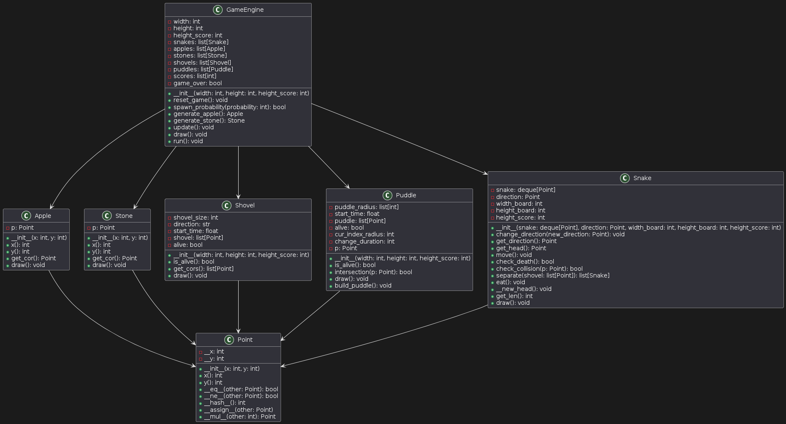
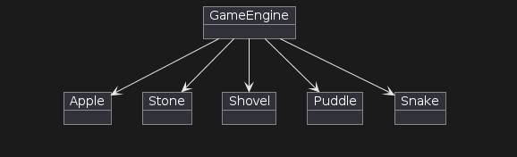

# Структурные модели

## Описание классов игрового движка

- **GameEngine**: Класс, представляющий игровой движок. Он управляет всеми аспектами игры, включая инициализацию, обновление состояния и отображение игровых объектов.

- **Apple**: Класс, отвечающий за создание и отображение яблок на игровом поле. Яблоки служат для увеличения длины змеи и увеличения счета.

- **Stone**: Класс, представляющий камни на игровом поле. Камни являются препятствиями, с которыми змеи не могут столкнуться.

- **Shovel**: Класс, управляющий лопатами. Лопата может использоваться для разделения змеи на части.

- **Puddle**: Класс, представляющий лужи на игровом поле. Лужи являются временными препятствиями, которые могут изменять размер со временем.

- **Point**: **Структура данных**, представляющая координаты на игровом поле. Она используется другими классами для определения позиции различных объектов.

- **Snake**: Класс, представляющий змей на игровом поле. Он управляет всеми аспектами поведения змей в игре.
 ## Диаграмма объектов
 
- **GameEngine**: Основной объект, управляющий игровым процессом. Он содержит список всех активных объектов в игре, таких как яблоки, камни, лопаты, лужи и змейки. GameEngine отвечает за обновление состояния игры и ее отображение.

- **Apple**: Объект, представляющий яблоко на игровом поле. Яблоки генерируются случайным образом и являются целью для змейки. Когда змейка съедает яблоко, ее длина увеличивается.

- **Stone**: Объект, представляющий камень на игровом поле. Камни являются препятствиями для змейки и должны быть избегнуты. Они генерируются случайным образом в течение игры.

- **Shovel**: Объект, представляющий лопату на игровом поле. Лопаты позволяют змейке разделиться на несколько частей. Они также появляются случайным образом в течение игры.

- **Puddle**: Объект, представляющий лужу на игровом поле. Лужи могут изменять свой размер и влиять на движение змейки. Они генерируются случайным образом и могут исчезать после определенного времени.

- **Snake**: Объект, представляющий змейку на игровом поле. Змейка управляется игроком и должна избегать столкновений с камнями и самой собой. Когда змейка съедает яблоко, она становится длиннее.